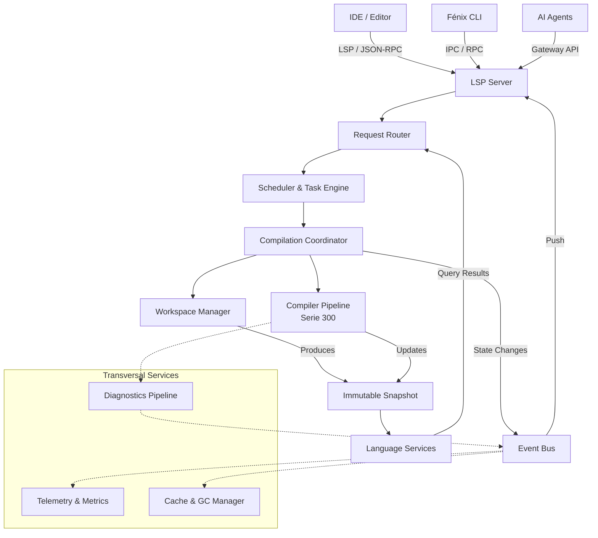

# SPEC-400: Compiler Host Architecture

## 1. Executive Summary

El Compiler Host constituye el Runtime principal del ecosistema Fénix y representa la única puerta de entrada para toda interacción entre clientes externos y el núcleo funcional del compilador. 

Actúa como el proceso orquestador (daemon) que envuelve el Pipeline de Compilación Fénix (Serie 300) y lo expone como un motor reactivo. Mientras que el núcleo del compilador (Parser, Binder, Semantic Analyzer) es matemáticamente funcional, puro, sin estado e inmutable, el Compiler Host vive en el mundo real: es concurrente, con estado (stateful), guiado por eventos (event-driven) y debe lidiar con I/O, latencia y cancelaciones.

Su responsabilidad primordial es gestionar la concurrencia masiva (cientos de agentes de IA y peticiones del IDE simultáneas) sobre el código fuente, garantizando que todos los clientes observen instantáneas (snapshots) inmutables y consistentes, al mismo tiempo que encola, cancela y reintenta las tareas de compilación necesarias a medida que el código cambia.

## 2. Design Principles

El Compiler Host debe cumplir permanentemente con los siguientes principios arquitectónicos fundacionales:

1. **Nunca modificar un Snapshot existente.** Todo cambio del Workspace debe producir un nuevo Snapshot inmutable.
2. **Nunca bloquear una petición interactiva por trabajo de background.** El tipado del usuario tiene prioridad absoluta.
3. **Nunca compartir estructuras mutables entre hilos.** Todo acceso concurrente se realiza sobre vistas de solo lectura.
4. **Toda operación deberá ser cancelable.** El trabajo obsoleto es un desperdicio letal de CPU y debe ser abortado inmediatamente.
5. **El Host nunca ejecutará lógica de compilación.** Únicamente la orquestará; la ejecución pertenece a la Serie 300.
6. **Las peticiones deberán ser deterministas respecto al Snapshot observado.** 
7. **Ningún componente podrá acceder directamente al estado interno de otro componente.** La comunicación se realiza vía interfaces rígidas o Event Bus.

## 3. Global Host Invariants

El cumplimiento de estas invariantes garantiza la estabilidad matemática del Host frente al caos concurrente:

* **Invariant H-001 (Consistencia):** Todo Snapshot publicado es completamente consistente interna y topológicamente. No existen Snapshots parciales.
* **Invariant H-002 (Determinismo Concurrente):** Dos clientes leyendo el mismo Snapshot y ejecutando la misma consulta, observarán exactamente los mismos resultados.
* **Invariant H-003 (Aislamiento de Lectura):** Una petición mutacional nunca podrá cambiar el Snapshot que está utilizando una petición de lectura en vuelo.
* **Invariant H-004 (Mutación Serializada):** El Scheduler nunca ejecutará dos mutaciones concurrentes sobre el mismo Workspace. Las escrituras están serializadas.
* **Invariant H-005 (Unicidad Activa):** Todo Workspace posee exactamente un Snapshot marcado como `Active` en cualquier instante de tiempo `T`.
* **Invariant H-006 (Identidad Versionada):** Todo Snapshot `Active` tiene un Version Token monotónico único que representa el estado exacto del código.

## 4. Architectural Decision Record (ADR) Summary

| ID | Decisión | Justificación |
|---|---|---|
| **CH-ADR-001** | El compilador permanece puro e inmutable | Facilita pruebas, determinismo y concurrencia extrema. |
| **CH-ADR-002** | Todas las mutaciones generan un nuevo Snapshot | Elimina condiciones de carrera y garantiza aislamiento entre peticiones. |
| **CH-ADR-003** | Las escrituras son serializadas y las lecturas lock-free | Optimiza la latencia del IDE sin sacrificar consistencia. |
| **CH-ADR-004** | El Host actúa únicamente como orquestador | Mantiene separadas la infraestructura (Serie 400) y la lógica del compilador (Serie 300). |
| **CH-ADR-005** | Comunicación entre subsistemas vía Event Bus | Reduce el acoplamiento y favorece la extensibilidad del Runtime. |

## 5. Non Goals

Para delimitar las responsabilidades, el Compiler Host **NO** es responsable de:
* Ejecutar el parser o interpretar el lenguaje.
* Resolver símbolos o calcular tipos.
* Almacenar o modificar físicamente archivos de proyectos en disco (eso es responsabilidad del VFS).
* Ejecutar la lógica o el razonamiento de la Inteligencia Artificial.
* Administrar procesos externos, contenedores o compiladores C/C++ nativos.
* Implementar políticas de negocio ni reglas específicas del lenguaje.

## 6. High-Level Architecture Diagram

El Host actúa como el sistema operativo del compilador, enrutando peticiones a través de subsistemas aislados y servicios transversales.



## 7. Runtime View

A nivel de proceso (OS), el Compiler Host se estructura en un árbol de dependencias y workers vivos:

```text
Host Process
 ├── Configuration Manager
 ├── Lifecycle Manager
 ├── Snapshot Manager
 ├── Metrics & Telemetry
 ├── Event Bus
 ├── Diagnostics Pipeline
 ├── Health Monitor (Watchdog Client)
 ├── Workspace Manager
 │    └── Virtual File System (VFS)
 ├── Task Execution Engine
 │    ├── Realtime Queue
 │    ├── Background Queue
 │    └── IO Queue
 ├── Scheduler
 │    └── WorkerPool
 │         ├── Worker 1 (CPU)
 │         ├── Worker 2 (CPU)
 │         ├── Worker 3 (CPU)
 │         └── Worker N (IO)
 └── Compiler Coordinator
```

## 8. Component Ownership

Para evitar acoplamientos y condiciones de carrera, la propiedad de las estructuras de datos (Ownership) establece qué puede hacer y qué NO puede hacer cada subsistema:

* **Workspace Manager:** owns `Workspace & VFS` | *cannot mutate snapshots.*
* **Snapshot Manager:** owns `Snapshots (Lifecycle)` | *cannot read specific AST nodes.*
* **Scheduler & TEE:** owns `Task Queues & WorkerPool` | *cannot access the semantic AST directly.*
* **Compiler Pipeline:** owns `Compilation Context` | *cannot publish network notifications.*
* **Event Bus:** owns `Subscription Registry` | *cannot perform any business logic in its dispatch loops.*

## 9. Request Lifecycle & States

Toda petición (Request) tiene una máquina de estados propia e independiente. Dependiendo de si la petición altera el Workspace o si es puramente de lectura, los flujos varían.

**Flujo Mutacional (ej. `DidChange` / Edición de código):**
`Received` ➔ `Validated` ➔ `Scheduled` ➔ `Executing` ➔ `Publishing` ➔ `Completed`

**Flujo de Consulta (ej. `Hover`, `Completion`, `Find References`):**
Estas peticiones no modifican el estado ni publican diagnósticos.
`Received` ➔ `Validated` ➔ `Scheduled` ➔ `Executing` ➔ `Completed`

**Flujo de Cancelación (ej. Snapshot obsoleto):**
`Received` ➔ `Scheduled` ➔ `Cancelled` ➔ `Discarded`

## 10. Concurrency Model Summary

El modelo de concurrencia (detallado en SPEC-418) orquesta el acceso masivo:

| Operación | Paralela | Lock | Requiere Snapshot |
|---|---|---|---|
| **Hover / GoToDef** | Sí | No | Sí (Immutable) |
| **Completion** | Sí | No | Sí (Immutable) |
| **Diagnostics** | Sí | No | Sí (Immutable) |
| **ApplyEdit / DidChange**| No | Sí (Exclusivo) | Genera nuevo Snapshot |
| **Workspace Load** | No | Sí (Exclusivo) | Genera Snapshot Inicial |

## 11. Failure Model & Recovery Strategy

Toda infraestructura robusta asume que las cosas fallarán. A continuación se define si el error es recuperable para el compilador.

| Escenario de Fallo | Secuencia de Recuperación (Recovery Strategy) | Recoverable |
|---|---|---|
| **Syntax/Semantic Error** | Parser utiliza Recovery Tokens. Emite error. Sigue funcionando. | **Sí** |
| **Compiler Panic** (Bug) | `Recover()` ➔ Descartar Snapshot ➔ Mantener Previo ➔ Notificar IDE | **Sí** |
| **Disk Cache Corrupt** | Host loguea warning ➔ Desactiva caché de disco ➔ Pasa a RAM pura | **Sí** |
| **Workspace Load Failed** | Host transita a estado `Idle` ➔ Rechaza queries ➔ Espera reintento | **Sí** |
| **Worker Muere** (Panic fatal CGO) | Proceso principal crashea ➔ Watchdog reinicia ➔ Limpia `.lock` | **No** (Cold Start) |
| **OOM (Out Of Memory)** | SO mata proceso (SIGKILL) ➔ Reinicio limpio desde Watchdog | **No** (Cold Start) |
| **Agent Hoarding** | `ResourceManager` detecta High Watermark ➔ Fuerza `context.cancel()` a tareas de IA ➔ GC limpia Snapshot | **Sí** |

## 12. Host Startup & Shutdown Sequences

### Startup Sequence (Bootstrap)
`Verify Configuration` ➔ `Initialize Logger` ➔ `Load Plugins` ➔ `Create WorkerPool` ➔ `Initialize Metrics` ➔ `Initialize Event Bus` ➔ `Load Workspace` ➔ `Create Initial Snapshot` ➔ `Warm Caches` ➔ `Ready`

### Shutdown Sequence (Graceful)
`Stop Requests` ➔ `Cancel Background Tasks` ➔ `Flush Metrics` ➔ `Persist Caches` ➔ `Dispose Snapshots` ➔ `Terminate`

## 13. The Compiler Host Interface

La interfaz del Host debe operar como un *Façade* cerrado. No expone los subsistemas internos para manipulación, sino streams o interfaces de solo-lectura para mantener el encapsulamiento.

```go
package host

import "context"

// CompilerHost es el Façade central del ecosistema Fénix.
type CompilerHost interface {
    // Lifecycle
    Initialize(ctx context.Context, rootURI URI) error
    Shutdown(ctx context.Context) error
    
    // Mutations (Event-driven)
    ApplyEdit(ctx context.Context, edit WorkspaceEdit) error
    
    // Concurrency & Snapshots
    // Obliga a que todos los clientes piensen en Snapshots, no en archivos.
    AcquireSnapshot(ctx context.Context, projectID string) (CompilationSnapshot, error)
    
    // Services
    LanguageServices() LanguageServiceFacade
    
    // Observability (Interfaces de solo-lectura)
    // Se proveen explícitamente para monitoreo, NUNCA para manipular el estado interno.
    Observability() HostObservability
    
    // Event Stream
    // Devuelve un canal de solo-lectura para escuchar eventos del sistema.
    Events() <-chan WorkspaceEvent
}

type HostObservability interface {
    SchedulerStats() SchedulerStats
    TelemetryData() TelemetrySnapshot
}
```

## 14. Specification Cross-References

El Host se compone de múltiples subsistemas orquestados.

**Normative References (Language, Models & Compiler Core):**
* `Serie 100`: Especificación del Lenguaje.
* `Serie 200`: Modelos de Datos.
* `Serie 300`: Infraestructura del Compilador Puro.

**Informative References (Compiler Runtime & Host):**
Cada uno de estos componentes de la Serie 400 extiende y soporta a la especificación normativa principal.

| Subsistema / Tema | Especificación | Responsabilidad Principal |
|---|---|---|
| **Workspace Model** | [SPEC-401](401-workspace-model.md) | Topología VFS, Version Tokens e Identidad. |
| **Snapshot Manager** | [SPEC-402](402-workspace-snapshot-manager.md) | Inmutabilidad, Retención y Prevención OOM. |
| **Scheduler** | [SPEC-403](403-scheduler-architecture.md) | Prioridades (P0-P3) y Preemptive Throttling. |
| **Task Engine** | [SPEC-404](404-task-execution-engine.md) | Colas (Realtime/Background) y Aislamiento de Errores. |
| **Event Bus** | [SPEC-405](405-event-bus.md) | Pub/Sub asíncrono y Zero-Copy events. |
| **Background Services** | [SPEC-406](406-background-services.md) | Indexadores Globales y Fetchers asíncronos. |
| **Incremental Engine** | [SPEC-407](407-incremental-update-engine.md) | CoW referencial y fusión de ediciones. |
| **File System (VFS)** | [SPEC-408](408-file-system-abstraction.md) | Overlay FS, Memory Mounts y WASM support. |
| **Cache Manager** | [SPEC-409](409-cache-manager.md) | Estratos de Cache L1/L2/L3 y Desalojo. |
| **Diagnostics Pipeline**| [SPEC-410](410-diagnostics-pipeline.md) | Deduplicación, Cascading suppression. |
| **Notification System** | [SPEC-411](411-notification-system.md) | LSP Push y AI Gateway subscriptions. |
| **Worker Pool** | [SPEC-412](412-worker-pool.md) | Sizing dinámico (CPU vs IO) y Work Stealing. |
| **Resource Manager** | [SPEC-413](413-resource-manager.md) | Memory Watermarks y AI Backpressure. |
| **Lifecycle Manager** | [SPEC-414](414-lifecycle-manager.md) | Bootstrap, Hibernación y Crash Recovery. |
| **Session Model** | [SPEC-415](415-session-model.md) | AI Sandboxes y Virtual Workspaces concurrentes. |
| **Telemetry & Metrics** | [SPEC-416](416-telemetry-and-metrics.md) | Atomics Zero-Allocation, Counters e Histogramas. |
| **Host State Machine** | [SPEC-417](417-host-state-machine.md) | Idle, Loading, Compiling transitions. |
| **Concurrency Model** | [SPEC-418](418-concurrency-model.md) | RWLocks asimétricos y Lock-free readers. |
| **Failure Recovery** | [SPEC-419](419-failure-recovery.md) | Resiliencia ante Panics, red y fallos de IO. |
