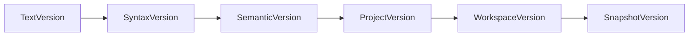

# SPEC-401: Workspace Model Architecture

## 1. Executive Summary

El Workspace Model es la representación estructural del código base del usuario. Traduce la jerarquía física (archivos y carpetas en disco o red) a una topología lógica (Soluciones, Proyectos, Módulos, Dependencias y Documentos). Funciona como la **Única Fuente de Verdad (SSOT)** para los contenidos de los archivos, tokens de versión y resolución de referencias.

Más que un simple contenedor de archivos, el Workspace de Fénix es una abstracción que representa el *estado lógico del conocimiento* del compilador en un instante dado, permitiendo alojar documentos físicos, generados, en memoria o provenientes de agentes de Inteligencia Artificial de forma unificada.

## 2. Design Principles

El Workspace deberá cumplir permanentemente los siguientes principios:

1. **El Workspace es completamente inmutable.**
2. **Todo cambio genera un nuevo WorkspaceSnapshot.**
3. **Los Documentos nunca existen fuera de un Workspace.**
4. **Un Documento pertenece exactamente a un Módulo/Proyecto.**
5. **Todo acceso al contenido ocurre mediante Version Tokens.**
6. **Ningún componente modifica directamente el VFS.**
7. **El Workspace representa el estado lógico del código, no el físico.**
8. **Todo acceso concurrente ocurre sobre Snapshots consistentes.**

## 3. Global Workspace Invariants

El cumplimiento de estas invariantes matemáticas asegura la consistencia estructural:

* **Invariant WS-001 (Pertenencia Estricta):** Todo Document pertenece exactamente a un Project/Module.
* **Invariant WS-002 (Aislamiento Jerárquico):** Todo Project pertenece exactamente a un Workspace.
* **Invariant WS-003 (Acyclic Topo):** No existen ciclos en el Dependency Graph dirigido entre proyectos.
* **Invariant WS-004 (Control de Versiones):** Todo Document posee Version Tokens válidos y monotónicos.
* **Invariant WS-005 (Totalidad del Snapshot):** Todo Snapshot representa un Workspace completo; no existen vistas parciales válidas para la compilación.
* **Invariant WS-006 (Estado Activo Único):** Nunca existen dos Snapshots marcados como `Active` simultáneamente para el mismo Workspace base.

## 4. Architectural Decision Record (ADR) Summary

| ID | Decisión | Justificación |
|---|---|---|
| **WS-ADR-001** | Workspace completamente inmutable | Permite escalabilidad masiva concurrente para agentes de IA e IDEs sin locks. |
| **WS-ADR-002** | Copy-on-write referencial | Reduce la huella de memoria y permite generar Snapshots en `O(1)`. |
| **WS-ADR-003** | VFS desacoplado del Sistema Operativo | Soporta Cloud IDEs, archivos en memoria e IA sin tocar discos físicos. |
| **WS-ADR-004** | Versionado granular escalonado | Habilita la invalidación de caché quirúrgica y evita recompilaciones innecesarias. |
| **WS-ADR-005** | DAG estricto de dependencias | Previene deadlocks en compilación e inferencia de tipos infinita. |
| **WS-ADR-006** | Desacoplamiento de Artefactos (Agnosticismo) | El Workspace almacena artefactos opacos. La Serie 300 define su semántica (AST, MIR). |

## 5. Non Goals

Para mantener su responsabilidad acotada, el modelo de Workspace **NO**:
* Compila código.
* Ejecuta análisis semántico o sintáctico.
* Modifica archivos físicos en disco.
* Administra hilos o concurrencia global (es responsabilidad del Host).
* Publica eventos al LSP o usuarios.
* Ejecuta lógica de agentes de IA.

## 6. Workspace Identity

Un Workspace es una entidad con identidad propia, origen y configuración de runtime.

* **Workspace ID:** Un identificador único generado al cargar el workspace, usado para aislar cachés (SPEC-409).
* **Workspace Origin:** Define la procedencia semántica del conocimiento: `Disk`, `Git`, `Memory` (Scratch), `AI Sandbox`, `Remote` o `Zip`.
* **Metadata:** Tiempo de creación, versión del compilador.
* **Runtime Configuration:** Flags del proyecto (ej. `TargetOS`, `StrictTypeChecking`).

## 7. Workspace Lifecycle

El estado del Workspace transita linealmente, pudiendo caer en estados inválidos:

`Created` ➔ `Loading` (Resolviendo VFS y Grafo) ➔ `Ready` (Snapshot inicial generado) ➔ `Modified` (Generando deltas continuos) ➔ `Disposed` (Limpieza de memoria y cache).

**Rutas de Invalidación:**
* `Loading` ➔ `Invalid` (Se detectan ciclos en las dependencias).
* `Ready` ➔ `Invalid` (Un directorio base es eliminado abruptamente del disco).

## 8. Structural Hierarchy

El modelo sigue un árbol profundo que modela el dominio del conocimiento, preparado para crecimiento a escala empresarial (multi-repo/multi-module):

```text
Workspace
 └── Solution (Virtual grouping)
      └── Project
           └── Module
                └── Document
```

## 9. Runtime View

Una vista de los componentes que residen vivos dentro de la instancia de un Workspace:

```text
Workspace
 ├── Metadata
 ├── Configuration
 ├── Solutions / Projects
 ├── Dependency Graph
 ├── Version Manager
 ├── Document Registry
 ├── Artifact Registry
 ├── VFS (Virtual File System)
 └── Snapshot Metadata
```

## 10. Document Model

El `Document` es la unidad atómica de información. No solo almacena texto, sino que aloja:

* **Identity:** URI, Language, Encoding.
* **Behavioral (States):** `Dirty`, `Generated`, `ReadOnly`, `Transient`.
* **Text & Lexical:** SourceText (Inmutable), LineMap (Mapeo de offset a fila/columna), TokenIndex, Trivia (Comentarios y espacios).
* **Compilation Artifacts (Agnostic):** Referencias opacas a estructuras producidas por el compilador (AST, Semantic Models, CFGs, MIR). El Workspace *aloja* los artefactos, pero no conoce su tipado; la Serie 300 los define.
* **Observability:** Diagnostics (Errors/Warnings), Generated Metadata, Hashes estructurales.

## 11. Version Tokens

Fénix utiliza un sistema de versionado hiper-granular en cascada para evitar recompilaciones cuando los cambios no afectan capas superiores:



* **TextVersion:** Cambia con cada pulsación de teclado.
* **SyntaxVersion:** Cambia si el árbol AST difiere del anterior (ej. editar comentarios no lo altera).
* **SemanticVersion:** Cambia si el Hash Estructural (firmas, exports) se altera.
* **Project/WorkspaceVersion:** Agregaciones topológicas que indican cuándo un cambio en un módulo afectó a dependientes.
* **SnapshotVersion:** Un ID global (UUID) que envuelve el estado holístico del Workspace completo en un milisegundo exacto.

## 12. Dependency Graph

El modelo mantiene un Grafo Dirigido Acíclico (DAG) formal de Project Dependencies.

* **Edge Direction:** El proyecto A depende explícitamente del B. A no puede compilarse hasta que B ofrezca una `SemanticVersion` estable.
* **Cycle Detection:** Aristas circulares (A -> B -> A) son detectadas durante el load y resultan en un Workspace `Invalid`.
* **Deterministic Traversal:** Dos recorridos sobre el mismo DAG bajo el mismo Snapshot **deben** devolver exactamente el mismo orden topológico de resolución.
* **Transitive Dependencies:** Calculadas automáticamente para propagar la visibilidad de tipos.
* **Invalidation Rules:** Si el proyecto C depende de B, y B modifica un archivo interno sin alterar su API pública, la `SemanticVersion` de B se mantiene, previniendo la recompilación de C.

## 13. Workspace Snapshot Semantics

Si bien el Host (SPEC-400) gestiona la concurrencia general, el Workspace define qué significa y cómo se comporta un Snapshot:

1. Todo Snapshot representa un Workspace de conocimiento **completo**.
2. Todo Snapshot es **inmutable** en profundidad.
3. Todo Snapshot puede **coexistir** pasivamente en memoria con versiones anteriores sin corromper el estado de los demás.
4. El Snapshot **mantiene referencias activas** que determinan su elegibilidad para recolección de memoria (GC).
5. Todo Snapshot puede ser **leído simultáneamente** por múltiples clientes (IDE, IA) sin incurrir en `RLocks` internos.

## 14. Memory Model (Ownership & Borrowing)

Para garantizar el escalamiento y prevenir memory leaks, se definen estrictas reglas de *Ownership* y *Borrowing*:

* **SourceText:** Es *Owned* por un pool centralizado. El `Document` hace un *Borrow* del texto (referencia a buffer inmutable compartido) hasta que el texto cambia completamente.
* **Compilation Artifacts:** El Snapshot hace un *Borrow* de los artefactos pesados generados por la Serie 300 (ej. AST). Si la raíz del Snapshot desaparece, el GC recolecta los artefactos huérfanos.
* **Snapshots:** El `Snapshot Manager` (SPEC-402) es el *Owner* del ciclo de vida y orquesta la recolección final.

## 15. Large Workspace Strategy

El Workspace Model está diseñado para cumplir las siguientes métricas objetivo en escala masiva:

* **Escala Objetivo:** 20 Projects, 15,000 Files, 400 AI Agents concurrentes.
* **RAM Footprint:** < 2GB de base (gracias al Copy-on-Write y el Borrowing de memoria).
* **Interactive Latency:** < 50ms para un Hover/Autocomplete (gracias a lecturas lock-free).
* **Incremental Build:** < 300ms para impacto transversal de cambios en el cuerpo de funciones.

## 16. Interface Contract

Para no acoplar los consumidores a implementaciones específicas (como slices subyacentes), el Workspace expone abstracciones iterables de solo lectura, permitiendo implementaciones perezosas (lazy loading).

```go
package workspace

import "context"

type Workspace interface {
    ID() string
    Origin() WorkspaceOrigin
    RootURI() URI
    Configuration() WorkspaceConfig
    
    // Topology & Iteration
    Projects() ProjectIterator
    GetProject(id string) (Project, error)
    DependencyGraph() DirectedGraph
    
    // Document Lookup (Global)
    GetDocument(uri URI) (Document, error)
    Documents() DocumentIterator
    
    // VFS Abstraction
    FileSystem() VFS
    
    // Mutations (Return new immutable snapshot)
    ApplyEdit(edit WorkspaceEdit) (WorkspaceSnapshot, error)
}

type ProjectIterator interface {
    Next() bool
    Value() Project
}

type ModuleIterator interface {
    Next() bool
    Value() Module
}

type DocumentIterator interface {
    Next() bool
    Value() Document
}

// ... Project, Module, and Document interfaces elided for brevity
```

## 17. Workspace Guarantees

Resumen de las promesas matemáticas y arquitectónicas del modelo:

| Garantía | Descripción |
|---|---|
| **Consistencia** | Todo Snapshot representa un estado de código válido (aunque con errores semánticos, estructuralmente íntegro). |
| **Determinismo** | La misma consulta sobre el mismo Snapshot produce matemáticamente el mismo resultado. |
| **Inmutabilidad** | Ningún consumidor puede modificar in-place un Snapshot existente. |
| **Aislamiento** | Las mutaciones entrantes nunca afectan las lecturas analíticas en progreso. |
| **Escalabilidad** | El modelo soporta miles de documentos y cientos de lectores concurrentes sin estrangular el OS. |

## 18. Specification Cross-References

El Workspace Model interactúa de manera directa o sirve como fundación de las siguientes especificaciones:

**Normative References (Language, Models & Compiler Core):**
* `Serie 100`: Especificación del Lenguaje.
* `Serie 200`: Modelos de Datos.
* `Serie 300`: Infraestructura del Compilador Puro (Quien define y genera los `Compilation Artifacts`).

**Informative References (Compiler Runtime & Host):**
* **[SPEC-400](400-compiler-host.md):** Compiler Host Architecture.
* **[SPEC-402](402-workspace-snapshot-manager.md):** Snapshot Manager.
* **[SPEC-403](403-scheduler-architecture.md):** Scheduler.
* **[SPEC-408](408-file-system-abstraction.md):** File System Abstraction (VFS).
* **[SPEC-409](409-cache-manager.md):** Cache Manager.
* **[SPEC-415](415-session-model.md):** Session Model (para Sandboxes virtuales de IA).
