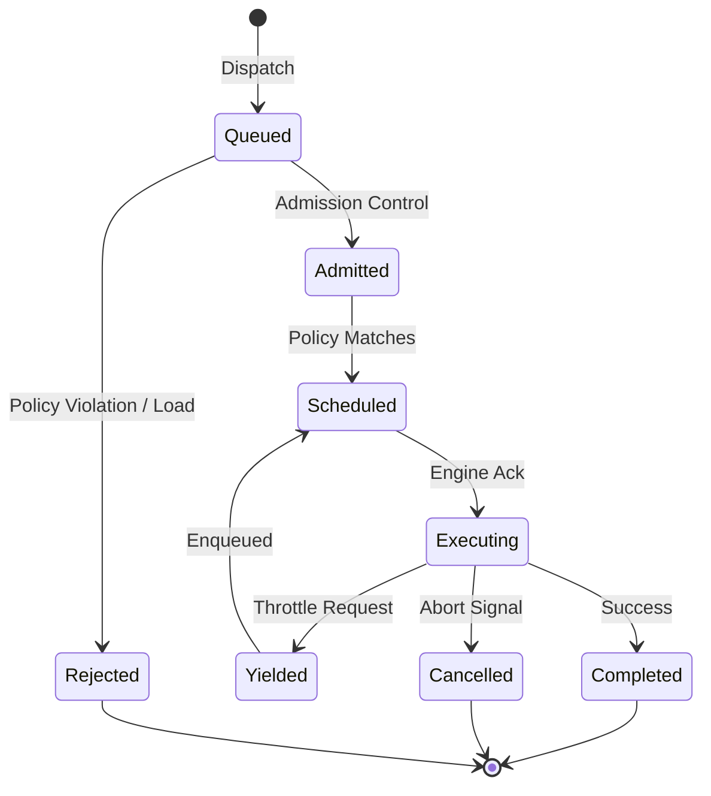

# SPEC-403: Scheduler Architecture

## 1. Executive Summary

El Compiler Host atiende peticiones masivas y concurrentes de múltiples orígenes: tipado en el IDE, consultas de agentes de Inteligencia Artificial (IA), herramientas de línea de comandos (CLI) y observadores de red. Retrasar una sugerencia de Autocomplete por 2 segundos arruina la experiencia del desarrollador (UX), pero tardar 2 segundos en descargar un paquete en segundo plano es perfectamente aceptable.

El *Scheduler* de Fénix es el núcleo orquestador de **ejecución, recursos y tiempo**. Es responsable de enrutar, admitir, priorizar, suspender y cancelar el trabajo en vuelo, ya sea que una tarea requiera cómputo intenso, descargas de red, llamadas a un LLM, acceso a disco o uso de caché. Su misión es garantizar de forma absoluta que las operaciones críticas jamás sufran *Starvation* a causa de tareas analíticas pesadas.

## 2. Definitions

Para garantizar el determinismo y la reproducibilidad, el Scheduler introduce tres conceptos base fundamentales:

* **Scheduler Clock:** Un reloj lógico y monotónico interno. Cada *Tick* del reloj dispara un *Scheduling Cycle* que eventualmente emite *ExecutionPlans* (`SchedulerClock -> Tick -> SchedulingCycle -> ExecutionPlan`). Evoluciona independientemente del reloj de pared (*wall-clock*) del SO.
* **Scheduling Cycle:** Una iteración indivisible y atómica donde el Scheduler evalúa la cola de entrada, resuelve dependencias, arbitra recursos y emite `ExecutionPlans`.
* **Scheduling Point:** El instante formal en el que el Scheduler puede reevaluar una tarea o emitir nuevas decisiones de planificación. Ejemplos incluyen: *Dispatch*, *Yield*, *Completion*, *Cancellation*, *Retry* y *Transition entre Epochs*. Jamás ocurre a la mitad de un opcode físico.

### 2.1. Scheduler Formal Model
Todo el documento gira matemática e irrevocablemente en torno a estas entidades fundamentales que describen la planificación pura:
`Task` ➔ `ExecutionPolicy` ➔ `ExecutionPlan` ➔ `ExecutionSession` ➔ `ExecutionResult` ➔ `Observability`

## 3. Scope

Este documento especifica la semántica de la planificación (Scheduling) en Fénix. Cubre las políticas de admisión, arbitraje de recursos y ciclos de vida de las tareas.
No cubre la ejecución física en hilos o hardware, lo cual está delegado al **Task Execution Engine (SPEC-404)**.

## 4. Design Principles & Scheduling Goals

El Scheduler opera bajo principios estrictos de justicia y priorización. Su comportamiento está diseñado para optimizar los siguientes objetivos fundamentales (**Scheduling Goals**):

1. **Latency:** Nunca bloquear el Main Thread del IDE (Interactive). El tipado del usuario tiene prioridad incondicional.
2. **Throughput:** Maximizar la utilización de recursos para tareas analíticas pesadas (Background).
3. **Fairness:** Preempción Cooperativa Rigurosa. Las tareas pesadas ceden la ejecución equitativamente cuando se les solicite.
4. **Isolation:** El pánico de una tarea jamás debe derribar al Scheduler.
5. **Determinism & Predictability:** La asignación de recursos debe ser estrictamente reproducible basada en políticas formales.
6. **Resource Efficiency:** Cancelación Agresiva. El trabajo obsoleto es trabajo tóxico. Las tareas sobre Snapshots superados se abortan inmediatamente.
7. **Energy Awareness:** Agrupación y orquestación inteligente para no desperdiciar ciclos térmicos inútiles en laptops.

## 5. Global Invariants

* **Invariant SCH-001 (Monopolio de Latencia):** Si existe al menos una tarea con objetivo de latencia `Realtime` ejecutable, las tareas `Background` no obtendrán recursos.
* **Invariant SCH-002 (Interrupción Límite):** Toda tarea cederá el control en un tiempo máximo predefinido ($T_{yield}$) tras recibir una solicitud de *Throttle*.
* **Invariant SCH-003 (Resiliencia al Starvation):** Toda tarea admitida será ejecutada eventualmente.
* **Invariant SCH-004 (Limpieza de Obsolescencia):** Ninguna tarea operará sobre un Snapshot `Collectable` o `Stale` si existe una cancelación explícita en su rama.
* **Invariant SCH-005 (Plan Obligatorio):** Una tarea *JAMÁS* puede ejecutarse sin un `ExecutionPlan` válido y formalmente emitido.
* **Invariant SCH-006 (Determinismo):** Dado el mismo Snapshot, la misma ExecutionPolicy, el mismo DAG y el mismo RuntimeContext, el Scheduler *DEBE* producir exactamente el mismo ExecutionPlan.
* **Invariant SCH-007 (Epoch Ownership):** Todo `ExecutionPlan` emitido pertenece a exactamente un (1) `SchedulingEpoch`.
* **Invariant SCH-008 (Snapshot Binding):** Un `SchedulingEpoch` referencia a exactamente un (1) `WorkspaceSnapshot`.
* **Invariant SCH-009 (Epoch Immutability):** Un `SchedulingEpoch` *JAMÁS* cambia su `WorkspaceSnapshot` asociado.
* **Invariant SCH-010 (Plan Immutability):** Todo `ExecutionPlan` es estrictamente inmutable tras ser emitido.

## 6. ADR Summary

| ID | Decisión | Justificación |
|---|---|---|
| **SCH-ADR-001** | Execution Policies vs Prioridades | Modela cómo vive y compite la tarea, soportando fácilmente futuros casos de uso (Audio, LLM) sin reescribir el scheduler. |
| **SCH-ADR-002** | Admission Control Obligatorio | Previene colapsos por inundación (ej. 20k tareas de IA simultáneas). |
| **SCH-ADR-003** | Agnosticismo de Ejecución | El Scheduler desconoce si hay Threads, afinidades NUMA o GPUs físicas. Modela intenciones de trabajo; el Engine (SPEC-404) lo mapea a hardware. |
| **SCH-ADR-004** | Dependencias vía DAGs | Permite planificar el compilador como un pipeline (`Parse -> Bind -> Semantic`). |

## 7. Non Goals

El Scheduler **NO**:
* Ejecuta código en hilos (SPEC-404).
* Conoce afinidades de CPU, anclajes NUMA, o detalles de hardware subyacente.
* Administra memoria (SPEC-402).
* Fija cuotas globales de recursos (SPEC-413 Resource Manager).
* Compila código (Serie 300).

## 8. Domain Model (Scheduling Policies)

El Scheduler no clasifica el trabajo por "prioridad", sino mediante un modelo formal de `ExecutionPolicy` que es profundamente técnico e independiente del modelo de negocio. Una política describe inmutablemente la vida de la tarea, mientras que el estado en ejecución se aloja en el `TaskRuntime`.

### 8.1. ExecutionPolicy (Inmutable)
```text
ExecutionPolicy
 ├── SchedulingClass             (LatencyCritical, LatencySensitive, Throughput, Maintenance, BestEffort)
 ├── Domain                      (Interactive, Background, System, AI)
 ├── LatencyTarget               (ej. < 50ms)
 ├── CancellationPolicy          (Immediate, Graceful, Uncancellable)
 ├── RetryPolicy                 (Backoff, Jitter, Max Retries, Timeout)
 ├── PreemptionPolicy            (Cooperative Yielding, Non-Preemptible)
 ├── AdmissionPolicy             (DropIfFull, Queue, Backpressure)
 ├── FairnessPolicy              (Bypass Queue, Weighted Fair Queuing)
 ├── IsolationPolicy             (Sandbox, Trusted)
 └── RequestedResourceProfile    (CPU, RAM, GPU, Network solicitados abstractamente)
```

**RequestedResourceProfile vs GrantedResourceBudget:** El Scheduler separa explícitamente lo que la tarea pide de lo que el sistema permite. La política define el `RequestedResourceProfile`. El Scheduler interpela al Resource Manager, quien retorna un `GrantedResourceBudget` inyectado en el plan final.

### 8.2. TaskRuntime (Mutable)
El Scheduler rastrea el progreso en vivo de la tarea separándolo estrictamente de su política estática:
* `CurrentRetries`, `ConsumedBudget`, `YieldCount`, `WaitTime`, `Status`.

### 8.3. SchedulingEpoch
Cada decisión de planificación pertenece a un **Scheduling Epoch** (Época de Planificación).
Un Epoch está estrictamente atado a la vida de un Workspace Snapshot específico.

**Epoch Lifecycle:**
1. **Create:** Nace vinculado a un nuevo WorkspaceSnapshot (S35).
2. **Activate:** Se convierte en el Epoch receptor principal para el `Admission Controller`.
3. **Freeze:** Se detiene la admisión de nuevas tareas (cuando nace el S36).
4. **Retire:** Transición de las tareas en vuelo (Wait, Yield, Complete).
5. **Garbage Collect:** Cancelación masiva y purga final de los remanentes atascados.

## 9. Lifecycle & State Machine

Toda tarea despachada al Scheduler posee una máquina de estados estricta.



### Significado Formal de *Yield* (Preempción Cooperativa)
Cuando una tarea invoca un *Yield* en un *Scheduling Point*, contractualmente realiza lo siguiente:
1. Guarda su progreso intermedio de forma consistente.
2. Libera el worker del Execution Engine.
3. Conserva su `RuntimeContext` y posesión del `SnapshotLease`.
4. Mantiene *Ownership* de sus estructuras transitorias.
5. Transita de `Executing` a `Yielded` y se vuelve a encolar.

## 10. Runtime View

El Scheduler se particiona en subsistemas formales, comportándose como un compilador puro de tareas operacionales:

```text
Scheduler
 ├── Policy Resolver         (Identifica o infiere la ExecutionPolicy de la Tarea)
 ├── Admission Controller    (Ingesta, Rechazos, Backpressure)
 ├── Dependency Resolver     (Grafos DAG Parse -> Bind -> Semantic)
 ├── Resource Arbitrator     (Interpela cuotas contra SPEC-413)
 ├── Execution Planner       (Emisión Inmutable del ExecutionPlan)
 └── Engine Dispatcher       (Transmite el contrato abstracto hacia SPEC-404)
```

## 11. Algorithms

### 11.1. Scheduling Decision Model (Scheduling Cycle)
El cerebro del Scheduler opera a través del siguiente flujo de decisión lineal y determinístico:
`Task` ➔ `Policy Resolution` ➔ `Admission` ➔ `Dependency Check` ➔ `Resource Arbitration` ➔ `Queue Selection` ➔ `Dispatch` ➔ `Execution`

*Nota sobre Policy Resolution:* Si una tarea (ej. Hover) ingresa sin política completa, el **Policy Resolver** deduce e inyecta la política predeterminada (ej. `LatencyCritical`), relevando al usuario de conocer los detalles operacionales.

### 11.2. ExecutionPlan
El ExecutionPlan es el contrato formal inmutable emitido hacia el motor físico. Contiene una identidad criptográfica completa para simulación y validación:
* `PlanID`, `PlanVersion` y `PlanChecksum` (Para validación estricta y Caché).
* `EpochID`, `SnapshotID`, `SnapshotLease` (Propiedad formal de memoria).
* `PolicyHash` y `ExecutionPolicy` (El contrato solicitado).
* `TaskID` y `Dependencies` (Qué DAGs deben monitorearse).
* `GrantedResourceBudget` (Lo que el RM aprobó).
* `SchedulingConstraints` (Restricciones lógicas como `RequiresNetwork`, `RequiresGPU`. El Scheduler es agnóstico del anclaje NUMA o hilos OS).
* `SchedulingReason` (`Interactive`, `AI`, `Recovery`, `Retry`, `Timeout Retry`, `Background`).
* `Deadline`
* `RuntimeContext`
* `ExecutionHints` *(Implementation-defined optimization hints)*

### 11.3. Admission Control
La máquina de estados de Admisión es formal y estricta:
`Incoming` ➔ `Policy Validation` ➔ `Authorization` ➔ `Quota Check` ➔ `Dependency Check` ➔ `Accepted | Rejected | Delayed | Queued`

### 11.4. Resource Arbitration Flow
El Scheduler **no administra memoria ni hardware**. 
```text
1. Task (RequestedResourceProfile)
        ↓
2. Scheduler Arbitrator
        ↓
3. Resource Manager (SPEC-413)
        ↓
4. GrantedResourceBudget
        ↓
5. ExecutionPlan Emission
```

### 11.5. Scheduling DAG Semantics
Los grafos de dependencia tipan cómo colaboran las tareas:
* `Sequential`: Ejecución lineal estricta (`Parse -> Bind`).
* `Parallel`: Ramas independientes.
* `Barrier`: Un muro de sincronización.
* `Conditional`: Ejecuta rama solo si la tarea padre retorna una señal específica.
* `Scatter / Gather`: Fan-out masivo y recopilación en un solo nodo.
* `Join`: Unión de hilos dispares.

### 11.6. Fairness Algorithms
El mecanismo de enrutamiento es *pluggable* (Weighted Fair Queue, Lottery Scheduling, Round Robin, Deadline Queue). **El algoritmo planificador empleado DEBE preservar todas las garantías formales (Guarantees) del Scheduler sin importar su implementación.**

## 12. Consistency Model (Scheduling)

El Scheduler garantiza la integridad matemática de sus promesas:

1. **Estado Único:** Toda tarea observa exactamente uno de los estados de la máquina de estados. Nunca existen estados intermedios.
2. **Atomicidad de Transición:** Toda transición de estado es estrictamente atómica durante un *Scheduling Cycle*.
3. **Puntos de Planificación Estrictos:** Las políticas se evalúan **únicamente** en puntos formales de decisión (Scheduling Points).
4. **Ordering Guarantees:** Tareas `Sequential` garantizan matemáticamente su orden de despacho.
5. **Visibility Guarantees:** Todo *Yield* y *Complete* produce una barrera de memoria (`Happens-before`).

## 13. Failure Model

### 13.1. Escenarios de Fallo
| Escenario | Reacción del Scheduler | Impacto |
|---|---|---|
| **Worker Disappears** | Detectado vía timeout. Re-encola la tarea. | Retraso temporal. |
| **Task Panics** | Aislado por `recover()`. Tarea ➔ `Cancelled`. Emite Evento. | Ninguno al sistema. |
| **Timeout / Deadline** | Tarea ➔ `Cancelled`. Solicita revocación al motor. | Libera carga. |
| **Policy Corruption** | Rechazo inmediato en fase Admission. No se emite Plan. | Protección preventiva. |

### 13.2. Scheduler Self Protection
El Scheduler debe sobrevivir matemáticamente a anomalías extremas:
* *Task Panics* y *Worker Crashes* (vía Isolation en el Engine).
* Reinicios dinámicos de los Executors.
* Revocaciones brutas de recursos por parte del Resource Manager.

### 13.3. Cancellation Scopes (Raíz a Hojas)
La cancelación viaja jerárquicamente, aniquilando ramas enteras:
* **Host Scope:** Destruye absolutamente toda la cola y todo el motor.
* **Workspace Scope:** Elimina trabajo asociado a un proyecto.
* **Session Scope:** Extermina cualquier tarea atada a un Agente IA o CLI específico.
* **DAG Scope:** Aniquila la tarea actual y purga todas sus dependencias.
* **Task Scope:** Cancela una unidad aislada.

## 14. Performance Model

* **Overhead de Planificación:** < 1ms por decisión de enrutamiento (Policy Resolution a Dispatch).
* **Escalabilidad de Cola:** >10,000 tareas en estado `Admitted` simultáneamente sin degradar tareas `LatencyCritical`.

## 15. Observability

Dividido estructuralmente en tres canales consumidos crudos por **SPEC-416 (Telemetry)**:

* **Metrics:** `QueueLength`, `CPUOccupancy`, `SchedulingDelay`, `YieldRate`.
* **Events:** `TaskCancelled`, `PolicyViolation`, `AdmissionRejected`, `TaskRetried`.
* **Tracing (OpenTelemetry Spans):** Spans individuales conectables para modelar la vida entera (`Admission`, `Scheduling`, `Yield`, `Execution` y `Completion`).

## 16. Interface Contract

El `ExecutionPlan` es inmutable y de solo lectura una vez emitido. Si las condiciones cambian drásticamente, **se debe generar un nuevo ExecutionPlan; el existente nunca se modifica** (Plan Validity Guarantee).

```go
package scheduler

// Interfaz del orquestador principal
type Scheduler interface {
    Schedule(ctx RuntimeContext, policy ExecutionPolicy, task SchedulableTask) (TaskHandle, error)
    ScheduleDAG(ctx RuntimeContext, dag TaskDAG) ([]TaskHandle, error)
    CancelScope(scope CancellationScope, reason CancellationReason)
}

// ExecutionPlan: Contrato inmutable y Read-Only
type ExecutionPlan interface {
    ID() PlanID
    Version() PlanVersion
    Checksum() PlanChecksum
    Policy() ExecutionPolicy
    Budget() ResourceBudget
    Lease() SnapshotLease
    Context() RuntimeContext
}

// Control asíncrono retornado al caller
type TaskHandle interface {
    Plan() ExecutionPlan
    Status() TaskStatus
    Wait() error
    Cancel(reason CancellationReason)
}

// RuntimeContext: Modelo transversal universal que fluye hacia OpenTelemetry
type RuntimeContext interface {
    Done() <-chan struct{}
    Err() error
    Deadline() (time.Time, bool)
    CancellationToken() CancellationToken
    
    SessionID() string
    SnapshotID() string
    EpochID() string
    
    // OpenTelemetry Links
    CorrelationID() string
    TraceID() string
    SpanID() string
}
```

## 17. Guarantees

| Garantía | Descripción |
|---|---|
| **Liveness** | Todo trabajo admitido será procesado (cero starvation infinito). |
| **Responsiveness** | Tareas `LatencyCritical` obtienen recursos bajo sus SLA. |
| **Isolation** | Un crash en una tarea se confina y no corrompe al Host. |
| **Efficiency** | El trabajo inútil es purgado recursivamente. |
| **Plan Validity** | Un `ExecutionPlan` emitido nunca se muta retrospectivamente. |
| **Reproducibility** | El Scheduler es puro y determinista frente a entornos repetibles. |

## 18. The Grand Architectural Flow

```text
Workspace (SPEC-401)
       ↓
Snapshot (SPEC-402)
       ↓
Scheduling Epoch (SPEC-403)
       ↓
ExecutionPolicy
       ↓
Admission Control
       ↓
ExecutionPlan
       ↓
Execution Engine (SPEC-404)
       ↓
Worker Thread / OS
       ↓
Completion
```

## 19. Cross References

**Normative References:**
* `Serie 300`: El pipeline que provee las funciones `SchedulableTask` orquestadas.

**Informative References:**
* **[SPEC-400](400-compiler-host.md):** Compiler Host Architecture.
* **[SPEC-401](401-workspace-model.md):** Workspace Model.
* **[SPEC-402](402-workspace-snapshot-manager.md):** Snapshot Manager.
* **[SPEC-404](404-task-execution-engine.md):** Task Execution Engine.
* **[SPEC-413](413-resource-manager.md):** Resource Manager.
* **[SPEC-416](416-telemetry-and-metrics.md):** Telemetry & Metrics.
