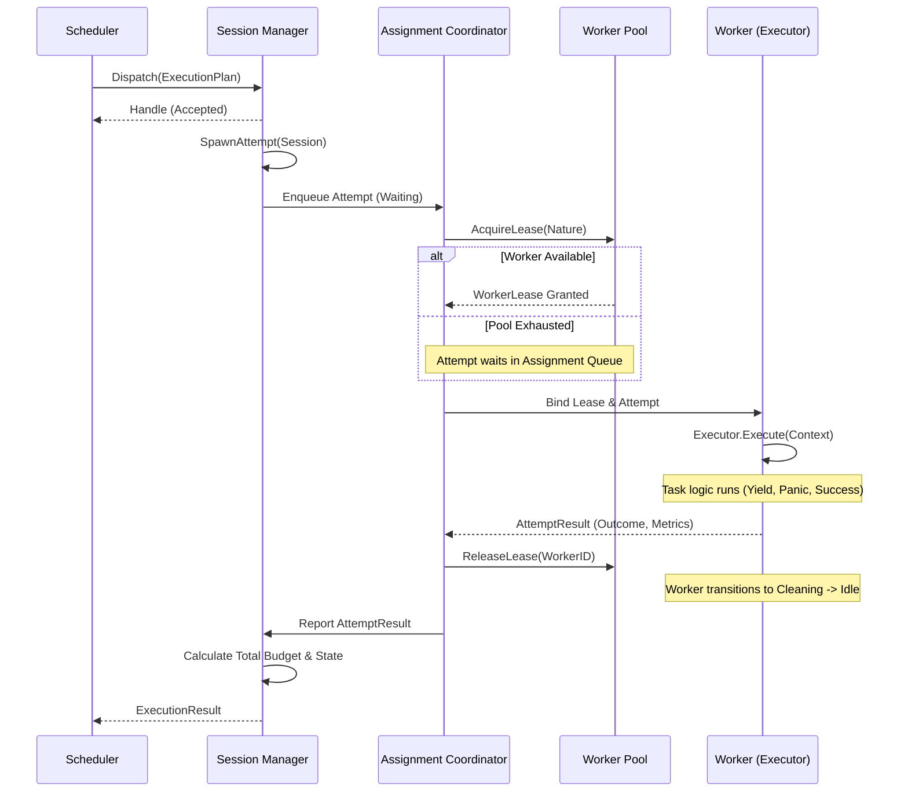

# SPEC-404: Task Execution Engine

## 1. Executive Summary
El Scheduler (SPEC-403) decide *qué* ejecutar, *cuándo* y bajo qué *contrato* (`ExecutionPlan`). El *Task Execution Engine* (TEE) es el músculo físico del sistema. Su única responsabilidad es recibir un contrato inmutable, asignarlo a un Worker físico, aislar los fallos, manejar la sesión de ejecución y retornar el resultado. El TEE es puramente mecánico y agnóstico del negocio; no enruta lógicamente, no planifica y no decide políticas. Solo ejecuta.

## 2. Definitions
* **Host:** The runtime instance responsible for maintaining worker pools, memory isolation, execution sessions, and hardware resources. It represents the physical bounds of the system.
* **Worker:** La infraestructura física de ejecución (una Goroutine, un Thread del SO, o un proceso contenedor). Provee ciclos de CPU y memoria.
* **Executor:** La lógica de control *hosteada* dentro de un Worker. Desempaqueta y ejecuta *ExecutionAttempts*.
* **WorkerPool:** Un proveedor pasivo de Workers físicos. No es una cola ni un planificador. Simplemente entrega Workers cuando el Engine los pide.
* **WorkerLease:** El derecho temporal exclusivo (*Temporal Ownership*) otorgado a un *ExecutionAttempt* para poseer un Worker. Su duración (*LeaseDuration*) es celosamente monitoreada.
* **Execution Session:** La entidad lógica con estado dentro del Engine que representa el ciclo de vida completo de un `ExecutionPlan` asignado. Rastrea el presupuesto *consumido* y el historial de progreso.
* **Execution Attempt:** La materialización física de un fragmento de ejecución en la CPU. Una `ExecutionSession` se compone de uno o más `ExecutionAttempts`. Ejemplo: Si una tarea hace *Yield*, finaliza el Attempt 1; al reanudarse, inicia el Attempt 2.
* **Execution Context:** El entorno encapsulado que agrupa dependencias inmediatas para la tarea física (`ctx`, `snapshot`, `logger`, `telemetry`, `allocator`, `cancellation`, `budget reader`, `progress reporter`).

## 3. Scope
* **In Scope:** Deserialización de `ExecutionPlans`, aislamiento de fallos (panics), asignación de Workers, administración de *Sessions* y *Attempts*, recolección de telemetría de ejecución física.
* **Out of Scope:** Planificación lógica, priorización, *Work Stealing*, validación lógica del scheduling, control de cuotas globales (Resource Manager), y manipulación directa del Snapshot.

## 4. Design Principles
1. **Blind Execution:** El Engine es ciego a la semántica. Un Plan es un Plan. No cuestiona su prioridad.
2. **Absolute Fault Containment:** Un panic de usuario jamás debe derribar al Engine. Cada *ExecutionAttempt* corre confinado en su Executor.
3. **Immutability of Contract:** El Engine respeta ciegamente los límites del `ExecutionPlan`. La sesión rastrea el consumo, pero el *Ownership* del presupuesto permanece en el Plan inmutable.
4. **Execution over Routing:** El Engine no redistribuye ni hace *Work Stealing*.

## 5. Formal Resource Graph (Ownership Model)
Para garantizar la ausencia de dependencias circulares y fugas de recursos (*leaks*), la ejecución física obedece un grafo matemático estricto de pertenencia. La propiedad fluye implacablemente hacia abajo:

```text
ExecutionPlan
        │  (owns)
        ▼
ExecutionSession
        │  (owns)
        ▼
ExecutionAttempt
        │  (leases)
        ▼
WorkerLease
        │  (binds)
        ▼
Worker
        │  (hosts)
        ▼
Executor
        │  (consumes)
        ▼
ExecutionContext
        │  (wraps)
        ▼
Task
```

**Ownership Invariants:**
* **OWN-001:** *Ownership never flows upward.* Ningún componente hijo retiene referencias del padre.
* **OWN-002:** *Workers never own Plans.* El Worker desconoce por completo el contrato original.
* **OWN-003:** *Plans never own Workers.* La asignación lógica y física están desacopladas.
* **OWN-004:** *Attempts are the only entities allowed to lease Workers.* Una Sesión jamás pide un Worker directamente.

## 6. Identity Model
Todo elemento en el Engine posee una identidad criptográfica rastreable:
* `ExecutionPlanID`
* `SessionID`
* `AttemptID`
* `WorkerID`
* `LeaseID`

**Regla de Identidad:** *Each identity is globally unique inside a Host. A child identity never replaces its parent identity.* Esto sella matemáticamente la jerarquía de Telemetría.

## 7. Formal System Properties

La robustez del motor se sustenta en garantías formales extraídas de sistemas distribuidos, separadas en *Safety* (lo malo nunca ocurre) y *Liveness* (lo bueno eventualmente ocurre).

### 7.1. Safety Properties (Invariants)
* **SP-001 (Attempt Singularity):** No Worker can execute two Attempts simultaneously.
* **SP-002 (Lease Exclusivity):** No Lease can reference two Workers, and no Worker can have two Active Leases.
* **SP-003 (Session Membership):** Every Attempt belongs to exactly one Session.
* **SP-004 (Contract Binding):** Every Session references exactly one immutable Plan.
* **SP-005 (Fault Containment):** A `panic` within an Attempt MUST be irrevocably caught by the Executor without bubbling up to the Engine.
* **SP-006 (I/O Segregation):** Tasks with `I/O` Nature MUST NOT consume capacity from the `CPU` WorkerPool.

### 7.2. Liveness Properties (Progress)
* **LP-001 (Lease Resolution):** Every `Granted` Lease *eventually becomes* `Released` OR `Revoked`. (Un Worker nunca se secuestra infinitamente).
* **LP-002 (Session Termination):** Every `Accepted` Session *eventually emits* `Completed`, `Failed`, or `Cancelled`.
* **LP-003 (Worker Sanitization):** No Worker remains forever in `Cleaning`. It *eventually transitions* to `Idle`.

## 8. ADR Summary
| ID | Decisión | Justificación |
|---|---|---|
| **EXE-ADR-001** | Validation vs Planning | El Engine hace validación estructural y física, nunca lógica. Evita duplicar el cerebro del Scheduler. |
| **EXE-ADR-002** | Sessions & Attempts Hierarchy | Permite modelar el *Yield* cooperativo y los bloqueos por pánico sin corromper la identidad principal del trabajo. |
| **EXE-ADR-003** | Executor as logical host | Desacoplar Worker (infraestructura) de Executor (lógica) permite cambiar goroutines por contenedores a futuro sin rediseñar. |

## 9. Non Goals
El TEE **NO**:
* Planifica ni resuelve dependencias DAG.
* Decide si un Attempt fallido debe reintentarse.
* Revoca recursos por iniciativa financiera propia.

## 10. Engine Component Model
La anatomía del Execution Engine se divide estrictamente en responsabilidades singulares:

```text
Execution Engine
 ├── Contract Validator       (Verificación estructural y física)
 ├── Session Manager          (Orquesta Sesiones y Attempts)
 ├── Assignment Coordinator   (Empareja Attempts con hardware)
 ├── Worker Pool Adapter      (Fachada hacia WorkerPools)
 ├── Lease Manager            (Administra ciclo de vida de los Leases)
 ├── Progress Monitor         (Detecta Zombies vía latidos/yields)
 ├── Fault Isolator           (Confinamiento de memoria/panics)
 └── Telemetry Publisher      (Exporta Spans, Eventos y Métricas)
```

## 11. Domain Model (Aggregates & Lifetimes)

Para proveer un nivel de rigor académico, cada Agregado define sus *State Invariants*, garantizando la correctitud de sus campos en cada fase de su ciclo de vida.

### 11.1. Execution Session Aggregate
La entidad lógica que orquesta el cumplimiento de un contrato matemático.
* `SessionID`
* `ExecutionPlanID` (Inmutable)
* `CurrentAttempt` (Pointer)
* `Attempts[]` (Historial)
* `AccumulatedBudget` (Consumo total)
* `State`
* `StartedAt` / `FinishedAt`
* `CancellationToken`

**State Invariants:**
* `Running`: `CurrentAttempt != nil`, `StartedAt != nil`
* `Completed`: `FinishedAt != nil`, `CurrentAttempt == nil`
* `Released`: `Attempts` array is strictly immutable.

### 11.2. Execution Attempt Aggregate
La materialización física del trabajo, poseedora de identidad y telemetría propia.
* `AttemptID`
* `SessionID`
* `LeaseID`
* `WorkerID`
* `AttemptNumber`
* `StartedAt` / `FinishedAt`
* `ExecutionNature` (CPU, IO)
* `Outcome`
* `ConsumedBudget`

**State Invariants:**
* `Running`: `LeaseID != nil`, `WorkerID != nil`, `StartedAt != nil`
* `Yielded / Panicked / Completed`: `FinishedAt != nil`

### 11.3. Worker Aggregate
La unidad de infraestructura gestionada por el WorkerPool.
* `WorkerID`
* `PoolID`
* `Capabilities` / `Affinity`
* `Lease`
* `Executor`
* `State`

**State Invariants:**
* `Idle`: `Lease == nil`, `Executor != nil`
* `Running`: `Lease != nil`
* `Cleaning`: `Lease == nil`, `Executor == nil` (Detached for reset)

### 11.4. Worker Lease Aggregate
El título temporal de propiedad sobre la infraestructura.
* `LeaseID`
* `WorkerID`
* `AttemptID`
* `GrantedAt` / `ExpiresAt` / `ReleasedAt`
* `State`

**State Invariants:**
* `Active`: `GrantedAt != nil`, `ReleasedAt == nil`
* `Released`: `ReleasedAt != nil`, `ReleasedAt >= GrantedAt`

### 11.5. AttemptResult Aggregate
Entregado por el Executor a la Sesión tras cada Attempt. Define rigurosamente la autopsia de un fragmento de ejecución.
* `Outcome` (`Success`, `Yield`, `Panic`, `Error`)
* `ExecutionError` (Nullable)
* `ConsumedBudget`
* `ExecutionDuration`
* `PanicStack` (Nullable, volcado de memoria si Outcome==Panic)
* `Metrics` (Context switches, allocs)

### 11.6. ExecutionResult Aggregate
Contrato terminal devuelto al Scheduler al finalizar el ciclo de vida de la Sesión.
* `Outcome` (Consolidado terminal)
* `ExecutionError`
* `TotalConsumedBudget`
* `TotalDuration`
* `TelemetryID` (TraceID raíz)

### 11.7. Resource Accounting Model
Para medir la huella ecológica de cada Sesión/Attempt, el `SessionManager` acumula y reporta dimensiones exactas:
* `CPUTime`: Ciclos efectivos de cómputo en el OS Thread.
* `WallClock`: Tiempo real desde `StartedAt` a `FinishedAt`.
* `AllocatedBytes`: Memoria requerida en el Heap.
* `IOWait`: Tiempo bloqueado esperando respuestas de red o FileSystem.
* `ContextSwitches`: Cantidad de Yields cooperativos invocados.
* `LeaseTime`: Tiempo absoluto reteniendo infraestructuras físicas.

### 11.8. Formal Resource Destruction & Ownership
El ciclo vital completo establece *quién destruye/libera* la memoria:

| Resource | Created By | Destroyed By | Destruction Timing |
|---|---|---|---|
| `Session` | `SessionManager` | `Garbage Collector` | Once all external references to `ExecutionResult` are dropped. |
| `Attempt` | `SessionManager` | `SessionManager` | Bound to Session lifetime. Immutable upon completion. |
| `Lease` | `LeaseManager` | `LeaseManager` | Immediately upon Attempt termination. |
| `Worker` | `WorkerPool` | `WorkerPool` | Never destroyed during normal Host operation (recycled). |
| `Context` | `ContextFactory` | `Worker (Cleaning Phase)` | Immediately upon Executor return. **Worker MUST NEVER retain references**. |

## 12. Temporal Model

El TEE opera bajo un modelo de reloj estricto para evitar inconsistencias lógicas. Se define el `HostClock` como fuente única de verdad monotónica.

**Invariantes Temporales:**
* **TMP-001 (Lease Bounds):** `LeaseGrantedAt < LeaseReleasedAt` (El tiempo no retrocede).
* **TMP-002 (Attempt Startup):** `LeaseGrantedAt <= AttemptStartedAt` (Ejecución requiere infraestructura previa).
* **TMP-003 (Logical Bounds):** `StartedAt <= FinishedAt` para toda entidad.
* **TMP-004 (Timeout Primacy):** Un `Deadline` expirado revoca inmediatamente el `Lease`.

## 13. Formal Cancellation Model

La cancelación no es un evento destructivo instantáneo; es un flujo formal de propagación de estado.

**Cancellation Sources:**
* `Scheduler` (Replanificación o Dependencia Fallida).
* `Runtime` (Timeout del Motor).
* `ResourceManager` (Presupuesto Agotado / OOM).
* `Parent Session` (Cascada DAG).
* `User` (Aborto Manual).

**Cancellation State Machine:**
`Requested` ➔ `Propagating (Context Signaled)` ➔ `Observed (Task Cooperative Exit)` ➔ `Cancelled (Outcome Emitted)`

## 14. Admission Control & Queue Model

El TEE no enruta, pero debe manejar el desbordamiento de carga cuando la demanda de *Plans* supera la oferta del *WorkerPool*.

### 14.1. The Assignment Queue
Cuando el `SessionManager` genera un `Attempt`, el `AssignmentCoordinator` intenta adquirir un `Lease`. Si el `WorkerPool` está agotado (capacidad al límite), el `Attempt` transita a estado `Waiting` y se encola en la **Assignment Queue** del `AssignmentCoordinator`.

### 14.2. Backpressure & Rejection
El tamaño de la `Assignment Queue` es finito.
* **Accepted:** Si la cola tiene espacio, el `Dispatch` es exitoso (`O(1)` asíncrono) y la Sesión queda `Waiting`.
* **Rejected (Backpressured):** Si la cola está llena, el Engine rechaza el `Dispatch` inmediatamente de forma sincrónica, devolviendo `ErrorEngineOverloaded`. Es responsabilidad del Scheduler aplicar *Exponential Backoff*.

## 15. Lifecycle, State Machines & Transitions

El modelo formal separa el *Estado* del *Outcome*.

### 15.1. Formal State Transition Table
Las transiciones de estado del Motor están matemáticamente cerradas para evitar ambigüedades.

| Entity | Current State | Event | Next State | Allowed? |
|---|---|---|---|---|
| **Worker** | `Idle` | `LeaseGranted` | `Running` | **Yes** |
| **Worker** | `Running` | `PanicCaught` | `Cleaning` | **Yes** |
| **Worker** | `Running` | `LeaseGranted` | `Running` | **NO** (Violates SP-001) |
| **Lease** | `Active` | `Expired` | `Revoked` | **Yes** |
| **Lease** | `Released` | `TaskYielded` | `Released` | **NO** (Terminal) |
| **Attempt** | `Running` | `TaskYielded` | `Yielding` | **Yes** |
| **Attempt** | `Yielded` | `TaskResumed` | `Running` | **NO** (Attempts immutable) |

### 15.2. Illegal State Combinations
Para propósitos de aserciones (`assert`), estas combinaciones son matemáticamente imposibles en el universo del TEE:

| Estado 1 | Estado 2 | Permitido |
|---|---|---|
| Worker `Idle` | WorkerLease `Active` en ese Worker | ❌ Imposible |
| Attempt `Running` | Session `Suspended` | ❌ Imposible |
| Attempt `Released` | Worker `Running` | ❌ Imposible |
| Lease `Released` | Worker `Running` | ❌ Imposible |
| Session `Completed`| Attempt `Running` | ❌ Imposible |

### 15.3. Worker & Lease Lifecycle
* **Worker:** `Offline` ➔ `Starting` ➔ `Idle` ➔ `Running` ➔ `Cleaning` ➔ `Idle`
* **Lease:** `Created` ➔ `Granted` ➔ `Active` ➔ `Released` | `Expired` | `Revoked`

### 15.4. Session & Attempt State
* **Execution Session:** `Created` ➔ `Accepted` ➔ `Running` ➔ `Waiting` ➔ `Suspended` ➔ `Completed` | `Cancelled` | `Failed` ➔ `Released`
* **Execution Attempt:** `Created` ➔ `Assigned` ➔ `Running` ➔ `Yielding` ➔ `Yielded` | `Cancelled` | `Panicked` | `Completed` ➔ `Released`

### 15.5. Execution Outcomes
Las emisiones terminales (Outcomes puros):
* `Success` (Completado exitosamente).
* `Yield` (Control cooperativo cedido).
* `Panic` (Fallo interno capturado).
* `BudgetRevoked` (Aborto forzado externo).
* `Rejected` (Validación física fallida o Backpressure).

## 16. Event Model & Ordering

### 16.1. Formal Event Contract (Payloads)
La estructura de los eventos principales garantiza tipado fuerte para el Event Bus:

* `LeaseGranted`: `{ LeaseID, WorkerID, AttemptID, GrantedAt }`
* `AttemptStarted`: `{ AttemptID, SessionID, WorkerID, ExecutionNature, Timestamp }`
* `AttemptCompleted`: `{ AttemptID, SessionID, Outcome, ConsumedBudget, Timestamp }`

### 16.2. Formal Event Ordering
La topología temporal obliga a un orden secuencial absoluto para cada Attempt.
**Orden Obligatorio:**
`AttemptSpawned` ➔ `LeaseGranted` ➔ `AttemptStarted` ➔ `AttemptCompleted / Panicked / Yielded` ➔ `LeaseReleased`

*Invariante de Ordenamiento:* Jamás existirá en el log de Telemetría un `AttemptStarted` posterior a un `LeaseReleased`.

## 17. Concurrency & Happens-Before Model

El Runtime define reglas matemáticas de acceso a memoria para evitar *Data Races* y *Deadlocks*.

### 17.1. Locking & Concurrency Rules
* **ExecutionSession:** *Single writer* (SessionManager vía eventos serializados), *Multiple readers* (Status polls).
* **Worker:** *No mutexes*. Single owner garantizado por el Lease.
* **WorkerLease:** *Lock-free / CAS (Compare-And-Swap)*.
* **SessionManager:** *Actor Model*. Procesa 1 evento por Sesión a la vez, eliminando mutexes contenciosos.
* **Telemetry:** *Lock-free* Ring Buffers.

### 17.2. Happens-Before Semantics
Heredado del modelo de memoria de Go, definimos las barreras lógicas estrictas:
* `LeaseGranted` **happens-before** `Executor.Execute()`
* `Executor.Execute()` return **happens-before** `Worker` transita a `Cleaning`.
* `Cleaning` completion **happens-before** `Worker` transita a `Idle`.
* `SessionCompleted` **happens-before** `SchedulerNotification`.

## 18. Formal Operation Contracts (Design by Contract)

Cada operación expone aserciones formales para su correcto funcionamiento.

### 18.1. Dispatch(ExecutionPlan)
* **Requires:** `Plan.Valid == true`
* **Ensures:** `Session.Created == true`, `Attempt.Count == 0`, `Session.State == Accepted`

### 18.2. SpawnAttempt(SessionID)
* **Requires:** `Session.State == Running OR Waiting`, `Session.Budget.Remaining > 0`
* **Ensures:** `Attempt.State == Created`, `AttemptNumber++`, `Session.CurrentAttempt != nil`

### 18.3. AcquireLease(ExecutionNature)
* **Requires:** `Worker.State == Idle`
* **Ensures:** `Lease.State == Granted`, `Worker.State == Running`, `Worker.CurrentLease == LeaseID`

### 18.4. Terminate(SessionID)
* **Requires:** `Session.State != Completed AND != Released`
* **Ensures:** `Session.CancellationToken.IsSignaled == true`, `All Active Leases Revoked`

## 19. Runtime Sequence View

La ejecución física exige una coreografía orquestada estrictamente a través de los componentes del motor.



## 20. Consistency & Memory Ownership Model

Garantías de aislamiento de memoria a nivel de diseño:
* **Memory Ownership Graph:** `ExecutionContext` *owns* `Allocator` ➔ `Buffers` ➔ `Temporary Objects`.
* **Execution Context Cleanup:** El Worker **MUST NEVER** retener referencias a la memoria del Attempt una vez terminada la fase `Cleaning`. Todo rastro del `ExecutionContext` debe ser destruido por el Worker.
* **Isolation:** Un `ExecutionContext` tiene prohibido acceder al contexto de otra sesión paralela.
* **Visibility:** Las mutaciones lógicas no son globalmente visibles hasta que la Sesión emite `SessionCompleted`.

## 21. Failure Model & Formal Error Taxonomy

### 21.1. Fault Isolation
Si ocurre un `panic`, el stack se confina, el Executor emite un `AttemptPanicked` y el Worker pasa a `Cleaning`. 

### 21.2. Formal Error Taxonomy
Todo fallo se clasifica bajo `ExecutionError`, determinando su remediación.

| Error Type | Meaning | Retryable (By Scheduler)? | Terminal (For Engine)? |
|---|---|---|---|
| `Panic` | User Code crashed | Yes (Policy) | Attempt Only |
| `Timeout` | Deadline Exceeded | Yes (Policy) | Attempt Only |
| `Cancellation` | Parent aborted | No | Session |
| `BudgetRevoked` | RM killed by OOM | Unknown (RM decides) | Attempt Only |
| `InvalidPlan` | Structural rejection | No | Session |
| `Infrastructure` | Worker Node died | Yes | Attempt Only |
| `InternalBug` | Engine State Corruption | No | Session |

## 22. Telemetry & Observability Model

Para automatizar la instrumentación (OpenTelemetry), el TEE garantiza matemáticamente la correlación de Identidades:
* El `TraceID` global es inyectado desde el `ExecutionPlan`.
* **Correlación Obligatoria:** Todo Span emitido por el Executor *DEBE* contener el tag de linaje completo:
  `[TraceID ➔ SessionID ➔ AttemptID ➔ WorkerID]`.
* Si la cadena se rompe, el motor incumple el contrato de observabilidad.

## 23. Algorithmic Complexity Bounds

Para asegurar latencia predictible en escenarios de escala hiper-concurrente, el Engine impone restricciones algorítmicas de tiempo límite para operaciones del *Hot Path*.

| Operation | Target Complexity | Notas |
|---|---|---|
| `Dispatch()` | **O(1)** | Push asíncrono a la cola. Sin esperas. |
| `SpawnAttempt()` | **O(1)** | Creación de agregado en memoria local. |
| `AcquireLease()` | **O(1) amortizado** | Fetch lock-free desde el Worker Pool. |
| `ReleaseLease()` | **O(1)** | Limpieza del puntero de Ownership. |
| `RecordBudget()` | **O(1)** | Acumulación matemática local (sin mutexes si Actor-based). |
| `Session Lookup` | **O(1)** | Radix-tree / Map por `SessionID`. |
| `Worker Lookup` | **O(1)** | Acceso directo por array indexado o map. |
| `Terminate()` | **O(N)** | Dónde `N` = Cantidad de Attempts *activos* de la Sesión (usualmente 1). |

## 24. Extension Points

Para asegurar evolución sin alterar el core normativo:
* `ProgressProvider`: Mecanismos customizables para evitar *Zombies*.
* `WorkerAllocator`: Políticas de selección de hardware (Bin-packing, Round-robin).
* `TelemetryExporter`: Adaptadores para Prometheus, OpenTelemetry.
* `ContextFactory`: Inyección de dependencias en el `ExecutionContext`.
* `LeasePolicy`: Estrategias de retención (Greedy vs Fair).
* `FaultPolicy`: Volcado de memoria (Stack dumps) post-panic.

## 25. Interface Contract

### 25.1. Internal Subsystem Interfaces
```go
package engine

type SessionManager interface {
    CreateSession(plan ExecutionPlan) (SessionID, error)
    SpawnAttempt(sessionID SessionID) (AttemptID, error)
    RecordBudget(sessionID SessionID, consumed ResourceBudget)
}

type AssignmentCoordinator interface {
    Assign(attempt ExecutionAttempt, nature ExecutionNature) error
}

type LeaseManager interface {
    AcquireLease(nature ExecutionNature) (WorkerLease, error)
    ReleaseLease(lease WorkerLease) error
    RevokeLease(lease WorkerLease)
}

type Executor interface {
    Execute(ctx ExecutionContext, attempt ExecutionAttempt) AttemptResult
}
```

### 25.2. External Engine Interfaces
```go
package engine

import "context"

type ExecutionEngine interface {
    Dispatch(plan ExecutionPlan) (ExecutionHandle, error)
    Shutdown(graceful bool) error
}

type ExecutionHandle interface {
    Wait(ctx context.Context) (ExecutionResult, error)
    Terminate() 
    SessionState() SessionState
}
```

## 26. Guarantees
| Garantía | Descripción |
|---|---|
| **Fault Containment** | Fénix *JAMÁS* colapsará por excepciones (`panic`) generadas en un *ExecutionAttempt*. |
| **Strict Delegation** | El Engine valida contratos y emite un Outcome puro. No decide reintentos lógicos. |
| **Worker Purity** | Un Worker siempre es sanitizado (*Execution Context Cleanup*) antes de un nuevo *Attempt*. |

## 27. Cross References
**Normative References:**
* **[SPEC-403](403-scheduler-architecture.md):** Scheduler Architecture.

**Informative References:**
* **[SPEC-412](412-worker-pool.md):** Worker Pool.
* **[SPEC-413](413-resource-manager.md):** Resource Manager.
