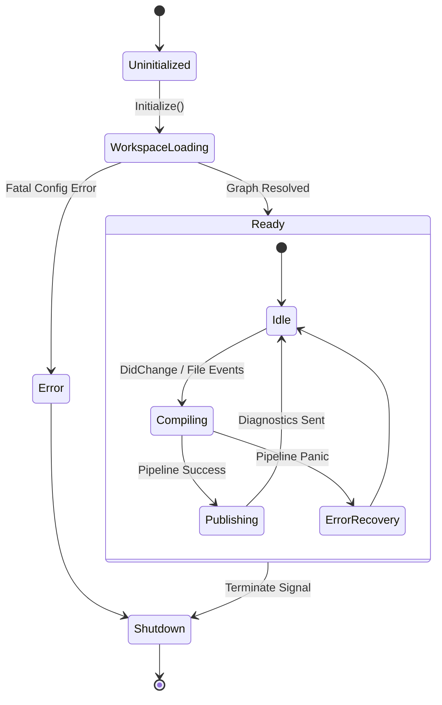

# SPEC-417: Host State Machine

## 1. Executive Summary

El Compiler Host transita a través de un conjunto finito de estados desde su arranque hasta su apagado. Esta Máquina de Estados Finita (FSM) es global, protege las invariantes de consistencia del sistema (asegurando que los clientes no hagan peticiones semánticas a un proyecto que aún está indexando), y funciona como el semáforo central del `Scheduler` (SPEC-403) para rechazar o encolar peticiones prematuras.

## 2. State Diagram

El ciclo completo del Host se define como:

## 3. Formal State Definitions

### 3.1. `Uninitialized`
* **Trigger:** El binario o daemon arranca. No hay URI raíz.
* **Allowed Actions:** Aceptar configuraciones de red, parsear banderas CLI, levantar servidor JSON-RPC.
* **Blocked Actions:** Toda petición de lenguaje devuelve el error `ServerNotInitialized`.

### 3.2. `WorkspaceLoading`
* **Trigger:** El cliente envía el comando `initialize` con la URI del workspace.
* **Actions:** El Host levanta el VFS, lee archivos de configuración de proyecto, descubre archivos fuente y construye el Grafo de Dependencias inicial.
* **Queued Requests:** Si un agente de IA lanza un Autocomplete en este estado, la petición se suspende en la *Realtime Queue* con un Timeout hasta que transicione a `Ready`. Si excede el Timeout, devuelve `ServerStillLoading`.

### 3.3. `Ready (Sub-State: Idle)`
* **Trigger:** El grafo de dependencias inicial se cargó y la primera pasada semántica terminó. 
* **Actions:** El compilador aguarda eventos. Uso de CPU baja al mínimo. Todos los servicios de lenguaje (Go to Definition, Hover, IA Prompts) están activos y operan sobre el último `ActiveSnapshot`.

### 3.4. `Ready (Sub-State: Compiling)`
* **Trigger:** Un `DidChange` es detectado desde VFS o el LSP.
* **Actions:** El *Incremental Update Engine* calcula diferencias. Se crea el nuevo WorkspaceSnapshot (Dirty) y se lanza el Pipeline de Compilación sobre los proyectos afectados.
* **Concurrency:** Las consultas del IDE *pueden seguir siendo respondidas* simultáneamente usando el Snapshot previo (Stale), a menos que el cliente prefiera bloquear esperando exactitud.

### 3.5. `Ready (Sub-State: Publishing)`
* **Trigger:** La pasada del Pipeline Semántico finaliza.
* **Actions:** El Host recolecta todos los errores, deduplica (Diagnostics Pipeline), genera notificaciones push para la UI y transita inmediatamente de vuelta a `Idle`.

### 3.6. `Shutdown`
* **Trigger:** El usuario cierra el editor (mensaje LSP `exit` o `shutdown`), o una señal OS `SIGTERM`.
* **Actions:** El Host detiene la aceptación de nuevas tareas (Drains the Queue), fuerza la cancelación vía `context.Context` de todos los backgrounds jobs en vuelo, realiza un barrido de telemetría final, y persiste los cachés estructurales al disco local para arranques rápidos en el futuro.

## 4. State Observability

El estado actual de la FSM debe estar siempre expuesto a través del *Notification System* (SPEC-411).
Si un comando CLI corre `fenix status`, recibe como salida exactamente el nombre de uno de estos estados y el porcentaje de progreso interno asociado (ej., "WorkspaceLoading - 75% Parsed").
